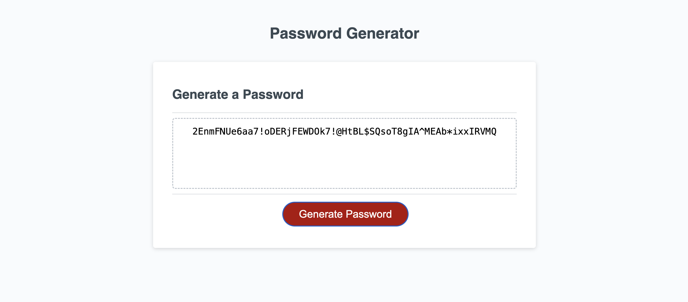

# Password Generator

## User Story

AS A developer
I WANT to create a password generator that allows users to customize their criteria
SO THAT the user has a strong password for increased security

## Acceptance Criteria

GIVEN I want to create a random password
WHEN I click the button to generate a password
THEN I am presented with a series of prompts for password criteria
WHEN prompted for the length of the password
THEN I choose a length of at least 8 characters and no more than 128 characters
WHEN asked for character types to include in the password
THEN I confirm whether or not to include lowercase, uppercase, numeric, and/or special characters
WHEN I answer each prompt
THEN my input should be validated and at least one character type should be selected
WHEN all prompts are answered
THEN a password is generated that matches the selected criteria
WHEN the password is generated
THEN the password is written in the box on the screen

## Assets

The following image demonstrates the web application's appearance and functionality:

## Deployment